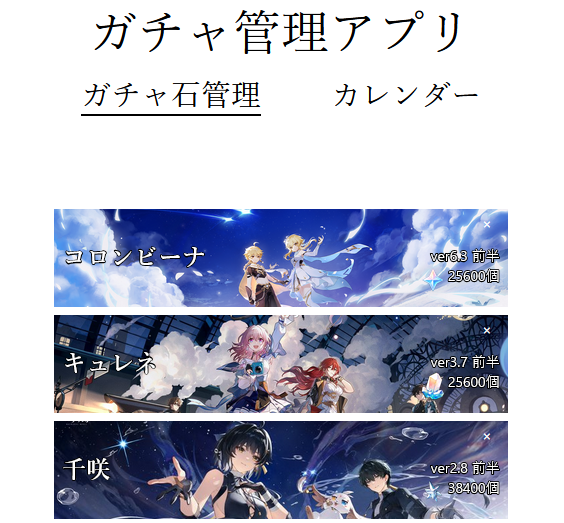
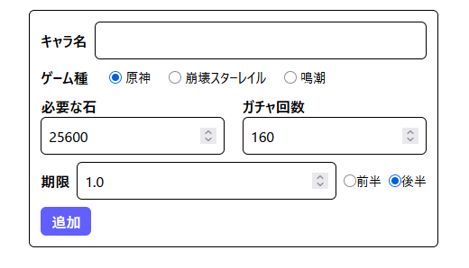
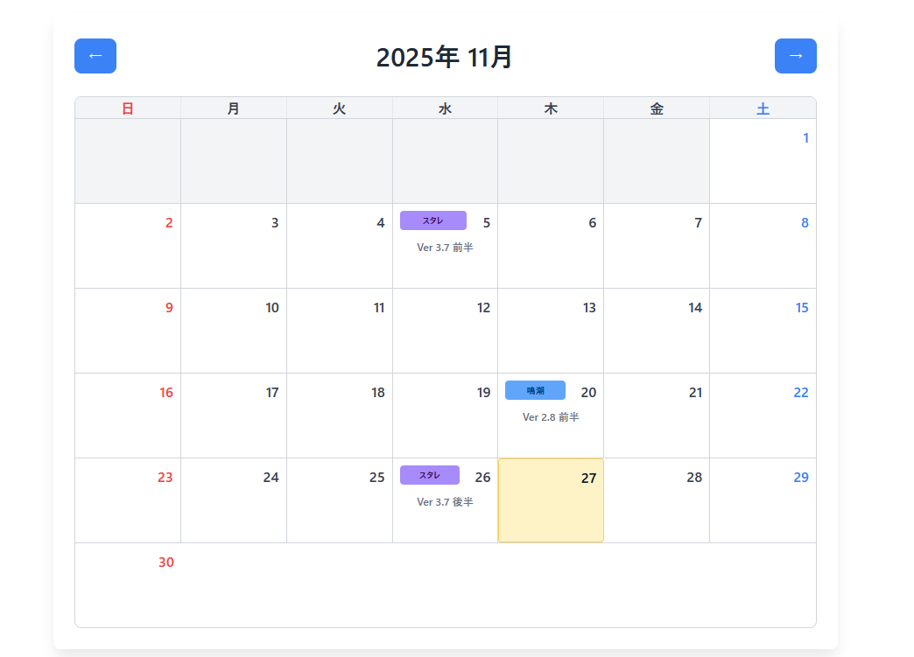

## 概要

原神・崩壊スターレイル・鳴潮のガチャ管理をサポートするアプリ

## アプリのURL

https://ykongr.github.io/react-todo-app

### 主な機能

- ゲームごとにキャラ名・必要な石・ガチャ回数・バージョン・期限（前半/後半）を登録
- タスクの追加・削除
- ガチャ更新のタイミングをまとめたカレンダー

### 技術構成

- React (Vite)
- TypeScript
- Tailwind CSS v4
- dayjs

### タスク管理の使い方

1. 「新しいタスクの追加」欄で必要事項を入力し「追加」ボタンで登録
2. 各タスクの削除ボタンで削除、チェックボックスで完了管理

### こだわり

- デフォルトのガチャ回数を対象のゲームの実質的な天井に設定してプレイヤーが使いやすくした
- ガチャ回数と石の数が連動するようにした
- カレンダーが見やすいようにゲームごとに色分けした

---

## 実行画像

## 開発期間

- 2025.10/30 ～ 2025.11/19 (16時間)
